# s_task 协程库的clion项目

该项目是为了学习s_task这个协程库而创建的，s_task库的地址为 https://github.com/xhawk18/s_task， 使用的版本是 https://github.com/xhawk18/s_task/commit/7b49dc599bb9bc62339ae9db7b46cc94c5bcc26f

## Table of content
- 协程环境初始化
- 协程创建
- 协程的切换

## 协程环境初始化

在main函数的一开始，调用了这么一个宏：
```
__init_async__
```

关于这个宏相关的有这么一些定义：
```c
#   define __await__      __awaiter_dummy__
#   define __async__      s_awaiter_t *__awaiter_dummy__
#   define __init_async__ s_awaiter_t *__awaiter_dummy__ = 0
```

`s_awaiter_t`是一个结构体，暂时撇下不管。`__awaiter_dummy__`这个实际就是一个变量名，和普通的变量`a`, `b`没有区别。调用`__init_async__`实际上就是声明了一个指向`s_awaiter_t`的指针变量，变量名叫做`__awaiter_dummy__`.`__await__`这个宏在后面使用得很多，但实际上只是指向了`__awaiter_dummy__`这个指针。  

接着再来看下函数`s_task_init_system`, 这个函数主要是对`g_globals`这个变量进行初始化，下面来了解下这个`g_globals`这个变量。  

`g_globals`是一个类型为`s_task_globals_t`的结构体  
```c
typedef struct {
    s_task_t    main_task;
    s_list_t    active_tasks;
    s_task_t   *current_task;

#ifndef USE_LIST_TIMER_CONTAINER
    RBTree      timers;
#else
    s_list_t    timers;
#endif

#if defined USE_LIBUV
    uv_loop_t  *uv_loop;
    uv_timer_t  uv_timer;
#endif

#if defined USE_IN_EMBEDDED    
    s_list_t         irq_active_tasks;
    volatile uint8_t irq_actived;
#endif
} s_task_globals_t;
```

函数`s_task_init_system`实际上就只做了这么几件事情：
- 初始化`g_globals`的`active_tasks`, 本质是一个双向链表
- 初始化`g_globals`的`timers`
- 初始化`g_globals`的`main_task`
- 调用了`my_clock_init`

这里出来一个新的数据结构`struct tags_s_task_t`，我们先把这个结构放这里，后面用到的时候再解析。
```c
typedef struct tag_s_task_t {
    s_list_t     node;
    s_event_t    join_event;
    s_task_fn_t  task_entry;
    void        *task_arg;
#if defined   USE_SWAP_CONTEXT
    ucontext_t   uc;
#   ifdef __APPLE__
    char dummy[512]; /* it seems darwin ucontext has no enough memory ? */
#   endif
#elif defined USE_JUMP_FCONTEXT
    fcontext_t   fc;
#endif
    size_t       stack_size;
    bool         waiting_cancelled;
    bool         closed;
} s_task_t;
```

还有这个`my_clock_init`, 这个等到讲时钟子系统的时候再进行讲解。

## 协程创建

在这一节，我们讲解下函数`void s_task_create(void *stack, size_t stack_size, s_task_fn_t task_entry, void *task_arg)`  

`void *stack`应该是指栈的地址,准确地说应该是栈顶的位置(栈在内存中是倒置的)  
`size_t stack_size`看名字应该是栈的大小  
`task_entry`是任务函数的入口地址  
`void *task_arg`是任务的参数  

来看下这个汇编写成的函数
```asm
_make_fcontext:
    /* first arg of make_fcontext() == top of context-stack */
    movq  %rdi, %rax

    /* shift address in RAX to lower 16 byte boundary */
    andq  $-16, %rax

    /* reserve space for context-data on context-stack */
    /* on context-function entry: (RSP -0x8) % 16 == 0 */
    leaq  -0x40(%rax), %rax

    /* third arg of make_fcontext() == address of context-function */
    /* stored in RBX */
    movq  %rdx, 0x28(%rax)

    /* save MMX control- and status-word */
    stmxcsr  (%rax)
    /* save x87 control-word */
    fnstcw   0x4(%rax)

    /* compute abs address of label trampoline */
    leaq  trampoline(%rip), %rcx
    /* save address of trampoline as return-address for context-function */
    /* will be entered after calling jump_fcontext() first time */
    movq  %rcx, 0x38(%rax)

    /* compute abs address of label finish */
    leaq  finish(%rip), %rcx
    /* save address of finish as return-address for context-function */
    /* will be entered after context-function returns */
    movq  %rcx, 0x30(%rax)

    ret /* return pointer to context-data */
```

要读懂这个函数，一行行来读

```asm
 /* first arg of make_fcontext() == top of context-stack */
movq  %rdi, %rax
```

`movq`是数据移动指令，比如将数据可以从寄存器到寄存器、内存到寄存器、从寄存器到内存，但是不能内存到内存。 `q`是后缀，表示操作的是64位数据。  
接着，我们来补充下寄存器的相关知识：
> X86-64有16个64位寄存器，分别是：%rax，%rbx，%rcx，%rdx，%esi，%edi，%rbp，%rsp，%r8，%r9，%r10，%r11，%r12，%r13，%r14，%r15。
> - %rax 作为函数返回值使用。
> - %rsp 栈指针寄存器，指向栈顶
> - %rdi，%rsi，%rdx，%rcx，%r8，%r9 用作函数参数，依次对应第1参数，第2参数
> - %rbx，%rbp，%r12，%r13，%14，%15 用作数据存储，遵循被调用者使用规则，简单说就是随便用，调用子函数之前要备份它，以防他被修改  
> from: https://blog.csdn.net/u013982161/article/details/51347944  

如何在IDEA里面进行汇编语句的调试呢？
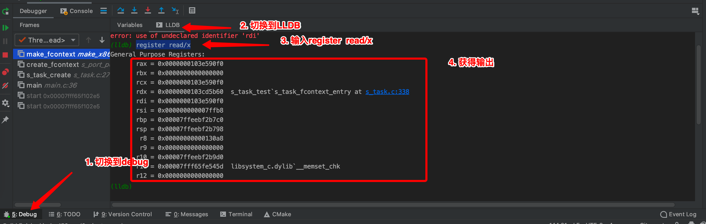 
那么上面这条指令，就是讲第1参数的值作为返回值  

 
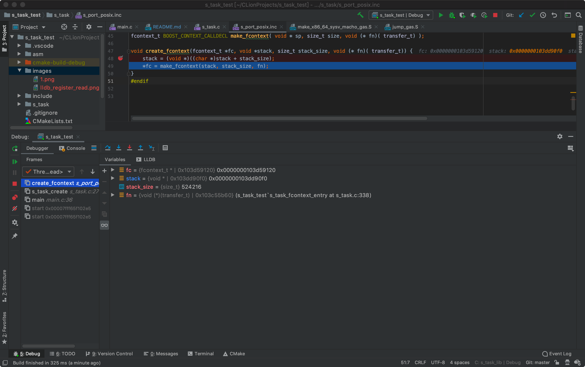 
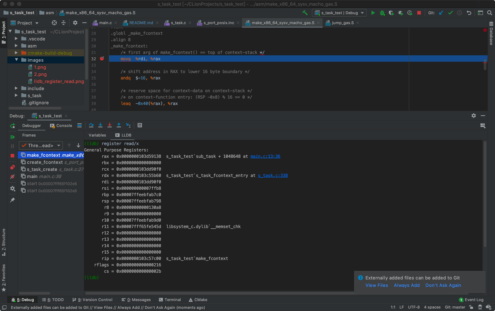 
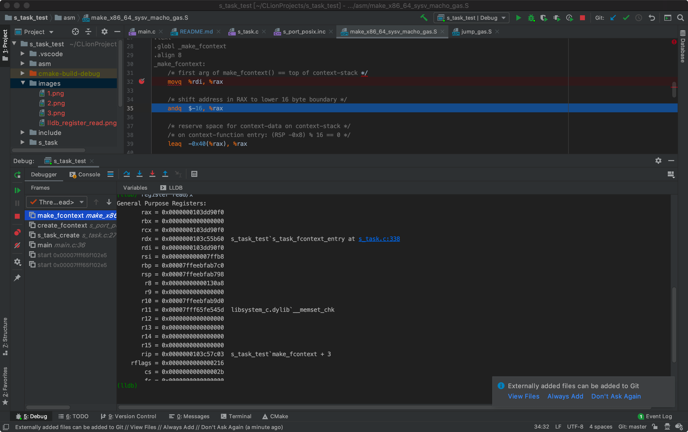 
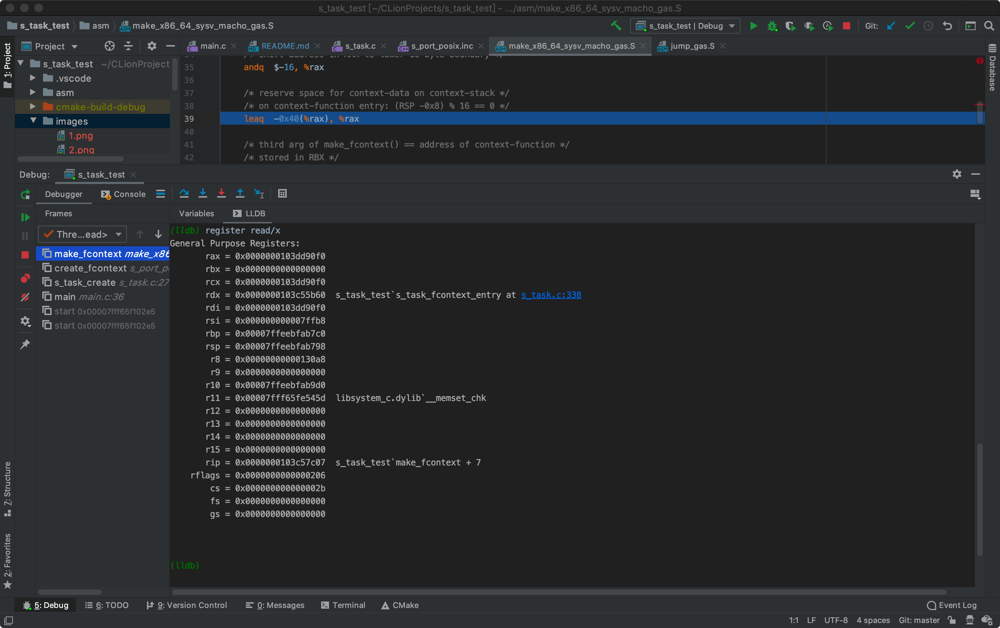 
 
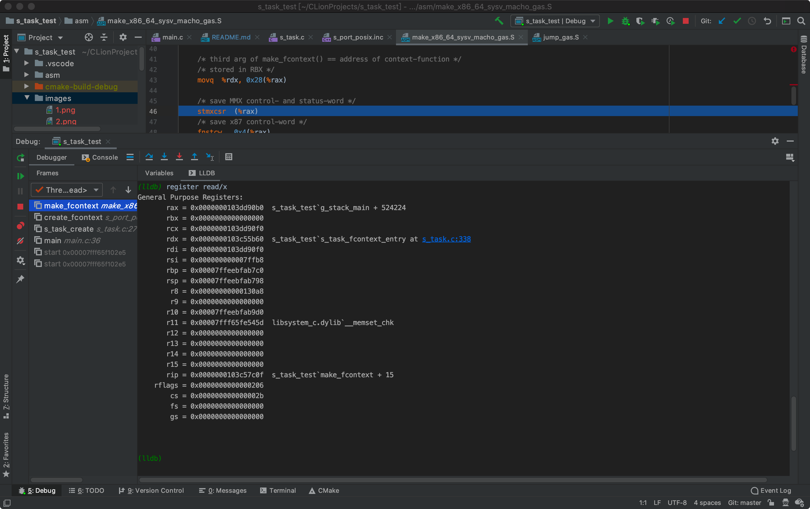 
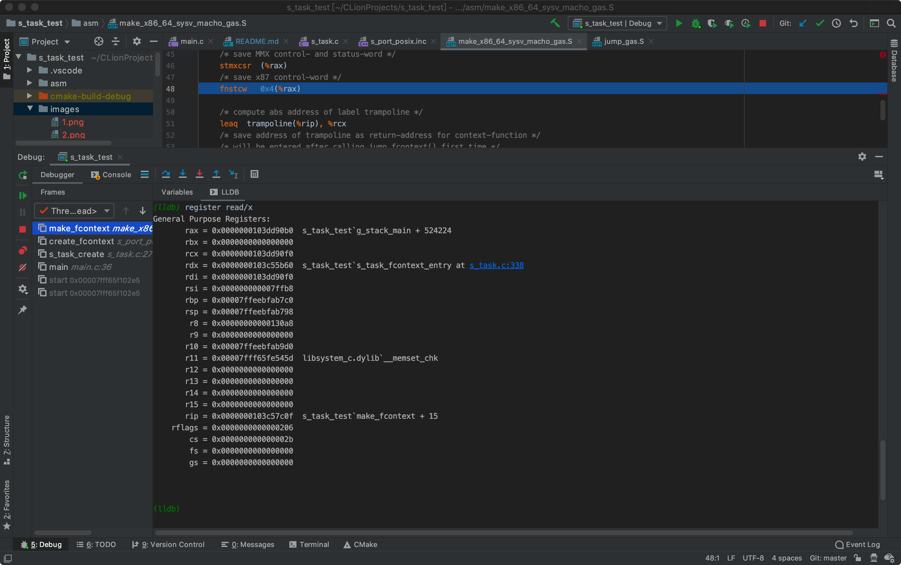 
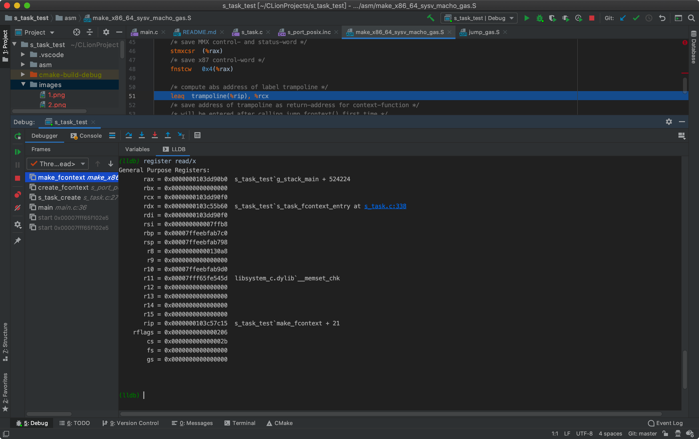 
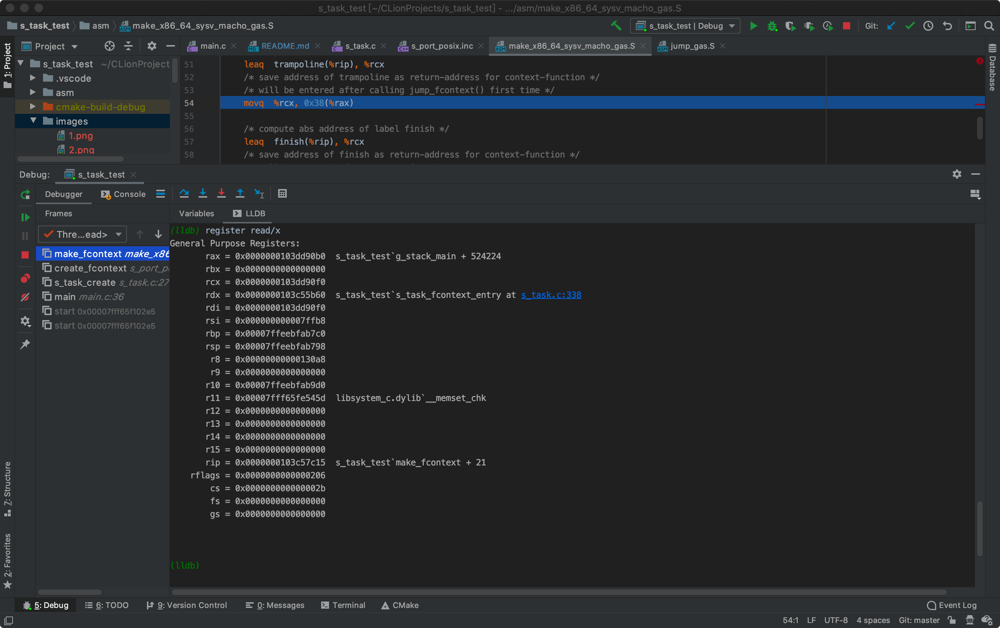 
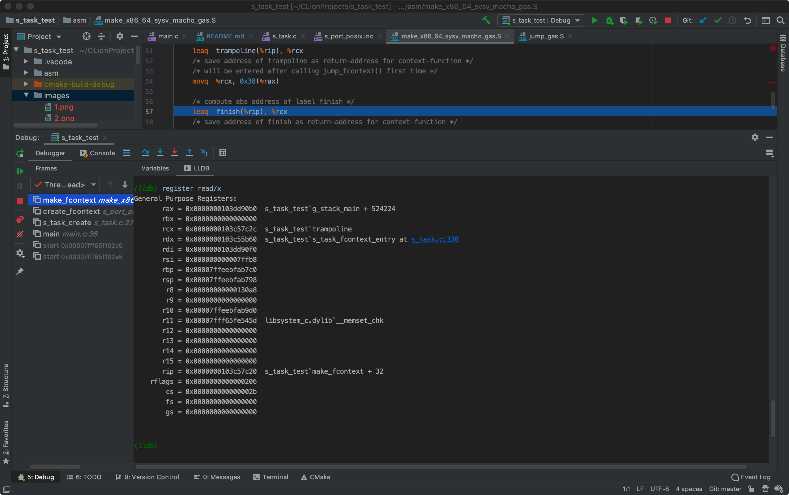 
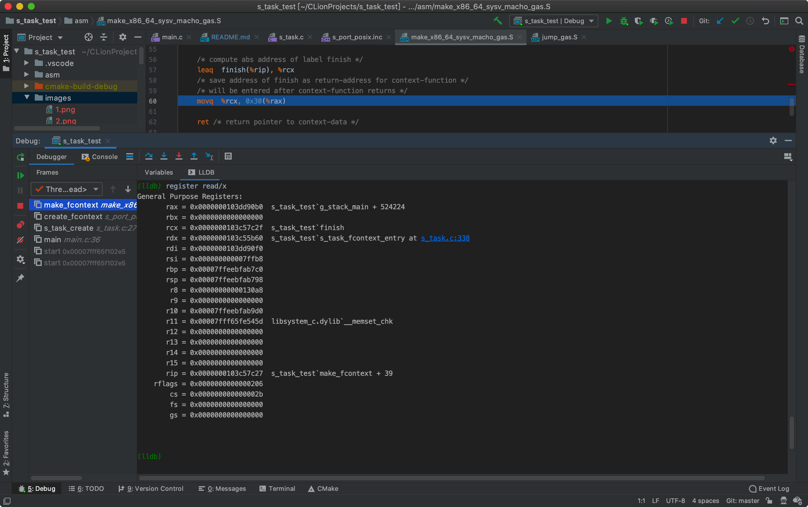 
 

-16的补码为`fffffff0`，对于负数的补码，就是对齐正数的补码按位取反后+1（这里包括符号位）。  那么这里的`andq  $-16, %rax`这条指令，其实就是`%rax & -16`，实际效果就是最后4位变成0，其余不变。暂时不清楚为什么需要这么做。   
TODO： 未完待续

## 协程的切换
TODO

## 时钟子系统
TODO